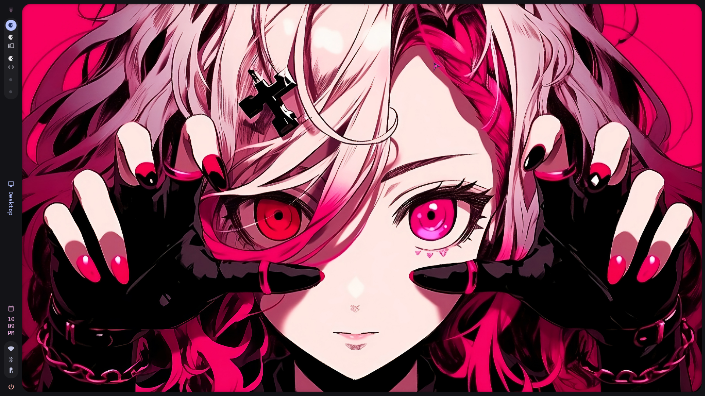
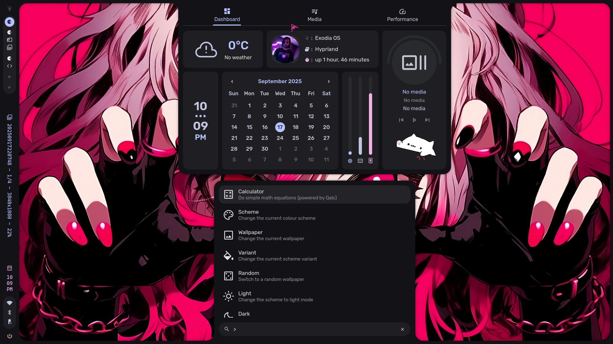
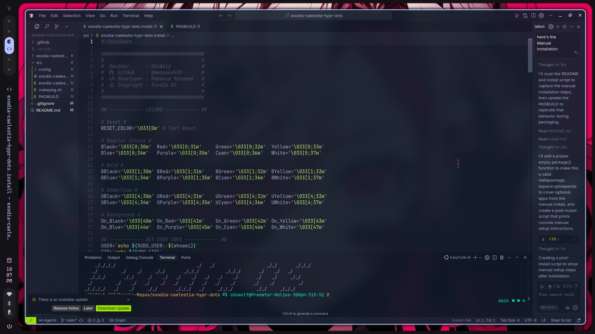
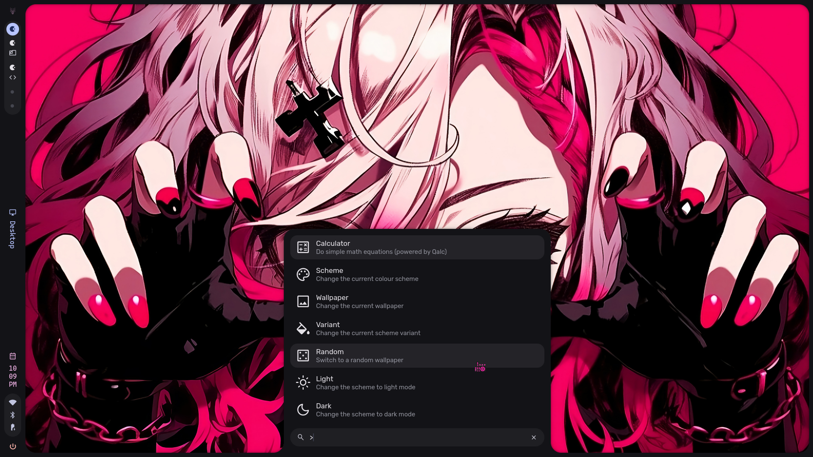
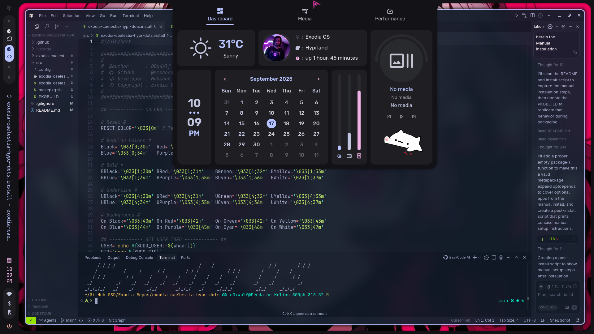

# 🌟 Exodia OS Caelestia Hyprland Configuration

A beautiful, modern, and highly customizable Hyprland desktop environment configuration for Exodia OS, featuring a celestial-inspired theme with smooth animations and intuitive workflows.

## ✨ Features

- **Modern Hyprland Setup**: Optimized configuration for smooth performance
- **Celestial Theme**: Beautiful dark theme with cosmic aesthetics
- **Fish Shell Integration**: Enhanced shell experience with starship prompt
- **Application Configurations**: Pre-configured settings for popular applications
- **Wallpaper Collection**: Curated wallpapers to match the theme
- **Easy Installation**: Simple installation via Exodia OS package manager

## 📦 Installation

### Via Exodia OS Package Manager

```bash
update
install exodia-caelestia-hypr-dots
```

## 🎨 Showcase

<div align="center">
  
  
  
  
  
</div>

## ⌨️ Keybindings

### Navigation
- `Super` - Open launcher
- `Super` + `#` - Switch to workspace `#`
- `Super` + `Alt` + `#` - Move window to workspace `#`
- `Super` + `S` - Toggle special workspace or close current special workspace

### Applications
- `Super` + `T` - Open terminal (foot)
- `Super` + `W` - Open browser (zen)
- `Super` + `C` - Open IDE (vscodium)

### System
- `Ctrl` + `Alt` + `Delete` - Open session menu
- `Ctrl` + `Super` + `Space` - Toggle media play state
- `Ctrl` + `Super` + `Alt` + `R` - Restart the shell
- `Ctrl` + `Shift` + `Q` - Quit Hyprland

> 📖 **Full Documentation**: The [keybinding.md](keybinding.md) file contains detailed information about all 190+ keyboard shortcuts, including workspace navigation, window management, media controls, utilities, and special workspaces.

## 📁 Configuration Structure

The package installs configurations for the following applications:

```
~/.config/
├── hypr/          # Hyprland configuration
├── foot/          # Terminal emulator config
├── fish/          # Fish shell configuration
├── fastfetch/     # System info display
├── btop/          # System monitor
├── uwsm/          # Session manager
└── starship.toml  # Shell prompt configuration

~/Pictures/Wallpapers/
└── Wallpapers/    # Curated wallpaper collection
```

## 🔄 Updates

To update your configuration:

```bash
update
upgrade exodia-caelestia-hypr-dots
```

## 🐛 Troubleshooting

### Common Issues

1. **Hyprland won't start**: Ensure all dependencies are installed and check the logs with `journalctl -u hyprland`

2. **Applications not themed**: Make sure GTK and Qt themes are properly configured:
   ```bash
   gsettings set org.gnome.desktop.interface gtk-theme 'adw-gtk3'
   qt5ct # Configure Qt5 theme
   qt6ct # Configure Qt6 theme
   ```

3. **Permissions issues**: Ensure your user is in the correct groups:
   ```bash
   sudo usermod -a -G audio,video,input,seat $USER
   ```

## 🤝 Contributing

Contributions are welcome! Please feel free to submit issues, feature requests, or pull requests.

## 📄 License

This project is licensed under the GPL-3.0 License - see the [LICENSE](LICENSE) file for details.

## 👨‍💻 Author

**Mahmoud Mohamed (00xWolf)**
- GitHub: [@mmsaeed509](https://github.com/mmsaeed509)
- Email: mmsaeed509@gmail.com
- credits [**`caelestia-dots`**](https://github.com/caelestia-dots/caelestia)

---

<div align="center">
  Made with ❤️ for the Exodia OS community
</div>